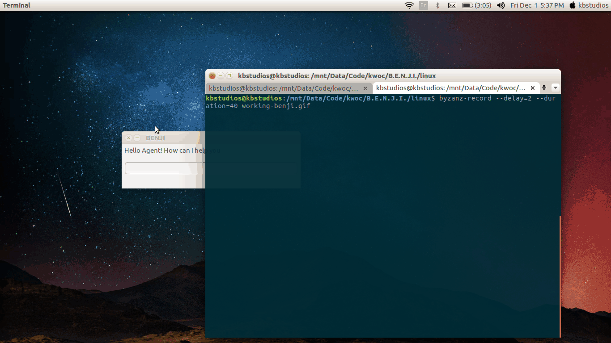

# B.E.N.J.I.

<h1 align="center">
	
	 
	 
</h1>

A digital assistant for your device that uses speech-recognition to obey your commands

NOTE: B.E.N.J.I. has been selected as a project for the [Kharagpur Winter of Code 2017](https://kwoc.kossiitkgp.in/) :tada:

### List of contents

- [Declassified debrief](#declassified-debrief)
- [Installation](#installation)
- [Contributing](#contributing)
- [Communicate](#communicate)
- [License](#license)

### Declassified debrief 

[(Back to top)](#list-of-contents)

Impossible Missions Force's debrief issued to the POTUS dated 30th May 2017: 
&nbsp;&nbsp;&nbsp; "On properly documented analysis and Congressional finding, the Impossible Missions Force(IMF) therefore, declassifies it's junior level digital assistant titled B.E.N.J.I.,short for Brilliant and Efficient non-Javascript enabled Intelligence Systems for civilian use. It might be noted that, this is only for peaceful purposes and the IMF does not hold any responsibility on its misuse. The Force however,has full right to control the activities of the system both,legally and illegally. The Force also submits that any covert action taken due to the system is not questionable to any Congressional hearing. Finally the Force asserts that none of its agents,operatives or analysts neither accept nor deny details of any operation regarding B.E.N.J.I. to any hearing without the Secretary's approval."

### Installation

[(Back to top)](#list-of-contents)

You can install B.E.N.J.I. on your laptop by cloning this repository as of first:
1. `git clone http://github.com/the-ethan-hunt/B.E.N.J.I`
2. Open your `IPython notebook` to `%run benji.py`. For `Command Prompt` try `python benji.py`.   
P.S. We are trying to make B.E.N.J.I. work for MacOS too. B.E.N.J.I. is currently working for `Linux` and `Windows` :tada:

### B.E.N.J.I working in Linux
 

### Contributing

[(Back to top)](#list-of-contents)

Contributions are welcomed heartily; any new `feature` or a `bug fix` is great! :smile:  

### Communicate

You will shortly be sent an invite to the Google discussion group after pinging me at dhruvgirishapte@gmail.com

### License

[(Back to top)](#list-of-contents)

The MIT License 2017 - [Dhruv Apte](http://github.com/the-ethan-hunt/).

