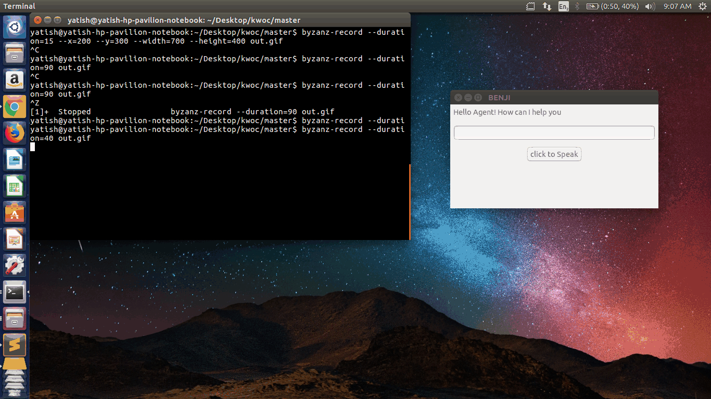

# B.E.N.J.I.

[](https://forthebadge.com/#)

[](http://shields.io/#your-badge)
[](http://shields.io/#your-badge)
[](http://shields.io/#your-badge)


[](http://shields.io/#your-badge)

[](https://gitter.im/B-E-N-J-I/Lobby)


<h1 align="center">
	
	<br>
	<br>
</h1>

A digital assistant for your device that uses speech-recognition to obey your commands

NOTE #1: B.E.N.J.I. has participated in the following Open-Source Programs: Kharagpur Winter of Code 2017, GirlScript Summer Of Code 2018, NJACK Winter of Code 2018 and Kharagpur Winter of Code 2018 :tada:

NOTE #2: I was invited to talk about B.E.N.J.I at the Open-Source Summit held at IIT Kharagpur on the 21st of January 2018. You can view the slides [here](https://github.com/the-ethan-hunt/B.E.N.J.I./blob/master/OSS_IIT_KGP_Dhruv_Apte.pdf). The video session is available to watch [here](https://www.youtube.com/watch?v=dydyiqR49KE&list=PLzumvJj1-3nDRq6Le2bFSmbtz0g7CppKb&index=11) :tada:

Maintainers : [Dhruv Apte](https://github.com/the-ethan-hunt), [Abhimanyu Thakre](https://github.com/abhimanyuthakre)

### List of contents

- [Declassified debrief](#declassified-debrief)
- [Installation](#installation)
- [Contributing](#contributing)
- [FAQs](#faqs)
- [License](#license)

### Declassified debrief

[(Back to top)](#list-of-contents)

<p>Impossible Missions Force's debrief issued to the POTUS dated 30th May 2017:<br>
&nbsp;&nbsp;&nbsp; "On properly documented analysis and Congressional finding, the Impossible Missions Force(IMF) therefore, declassifies it's junior level digital assistant titled B.E.N.J.I.,short for Brilliant and Efficient non-Javascript enabled Intelligence Systems for civilian use. It might be noted that, this is only for peaceful purposes and the IMF does not hold any responsibility on its misuse. The Force however,has full right to control the activities of the system both,legally and illegally. The Force also submits that any covert action taken due to the system is not questionable to any Congressional hearing. Finally the Force asserts that its agents,operatives or analysts neither accept nor deny details of any operation regarding B.E.N.J.I. to any hearing without the Secretary's approval."
</p>

### Installation

[(Back to top)](#list-of-contents)

You can install B.E.N.J.I. on your laptop by cloning this repository as of first:
1. `git clone http://github.com/the-ethan-hunt/B.E.N.J.I`
2. Open your `IPython notebook` to `%run benji.py`. For `Command Prompt` try `python benji.py`. <br><br>
Note:If a module is not found, then install each module by: pip install modulename<br>
P.S. B.E.N.J.I. now works for Windows, Linux and Mac OS :tada:

#### Mac Installation Troubleshooting

````
    creating build/temp.macosx-10.12-x86_64-3.6/src
    clang -Wno-unused-result -Wsign-compare -Wunreachable-code -fno-common -dynamic -DNDEBUG -g -fwrapv -O3 -Wall -Wstrict-prototypes -DMACOSX=1 -I/usr/local/include -I/usr/local/opt/openssl/include -I/usr/local/opt/sqlite/include -I/usr/local/Cellar/python3/3.6.4/Frameworks/Python.framework/Versions/3.6/include/python3.6m -c src/_portaudiomodule.c -o build/temp.macosx-10.12-x86_64-3.6/src/_portaudiomodule.o
    src/_portaudiomodule.c:29:10: fatal error: 'portaudio.h' file not found
    #include "portaudio.h"
             ^~~~~~~~~~~~~
    1 error generated.
    error: command 'clang' failed with exit status 1

    ----------------------------------------
Command "/usr/local/opt/python3/bin/python3.6 -u -c "import setuptools, tokenize;__file__='/private/var/folders/fv/cy3_1czs31q64478bzxd7_m5vdlrd8/T/pip-build-z73z9sim/PyAudio/setup.py';f=getattr(tokenize, 'open', open)(__file__);code=f.read().replace('\r\n', '\n');f.close();exec(compile(code, __file__, 'exec'))" install --record /var/folders/fv/cy3_1czs31q64478bzxd7_m5vdlrd8/T/pip-wh091sp7-record/install-record.txt --single-version-externally-managed --compile" failed with error code 1 in /private/var/folders/fv/cy3_1czs31q64478bzxd7_m5vdlrd8/T/pip-build-z73z9sim/PyAudio/
You are using pip version 9.0.1, however version 10.0.1 is available.
You should consider upgrading via the 'pip install --upgrade pip' command.
````
Command to solve the above: ```brew install portaudio && pip3 install pyaudio```

```
Traceback (most recent call last):
  File "MacOS/benji.py", line 3, in <module>
    from PIL import ImageTk
ModuleNotFoundError: No module named 'PIL'
```
Command to solve the above: ```pip3 install Pillow```

```
Traceback (most recent call last):
  File "MacOS/benji.py", line 10, in <module>
    import wikipedia
ModuleNotFoundError: No module named 'wikipedia'
```
Command to solve the above: ```pip3 install wikipedia```

```
Traceback (most recent call last):
  File "MacOS/benji.py", line 21, in <module>
    import speech_recognition as sr
ModuleNotFoundError: No module named 'speech_recognition'
```
Command to solve the above: ```pip3 install SpeechRecognition```

```
Traceback (most recent call last):
  File "MacOS/benji.py", line 23, in <module>
    import pyttsx3
ModuleNotFoundError: No module named 'pyttsx3'
```
Command to solve the above: ```pip3 install pyttsx3```

Change the pip version above according to what you have installed on your mac.

### B.E.N.J.I working in Linux


### B.E.N.J.I working on Windows


### B.E.N.J.I working on Mac


### Contributing

[(Back to top)](#list-of-contents)

Contributions are welcomed heartily; any new `feature` or a `bug fix` is great! :smile: <br>

### FAQs

[(Back to top)](#list-of-contents)

1. How to use B.E.N.J.I. to open a website/webpage?
* Say "facebook.com" and B.E.N.J.I. will open the requested page. Here, it's important to specify the top-level domain i.e. ".com".
2. How to use the news feature?
* Say "news the hindu" and B.E.N.J.I. will open list of latest "news" by requested news agency.
3. How to use the recording feature? (Windows)
* "UScreenCapture" and "ffmpeg" needed to run this feature.   

### License

[(Back to top)](#list-of-contents)

The MIT License 2017 - [Dhruv Apte](http://github.com/the-ethan-hunt/).
