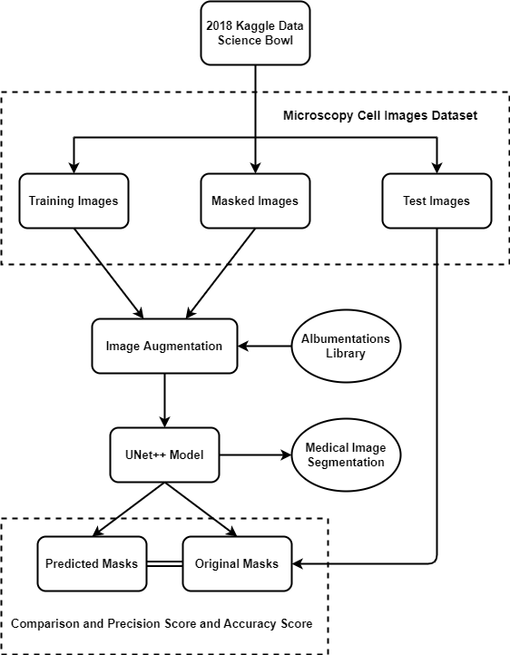
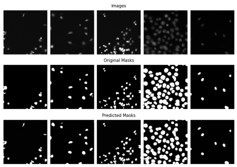
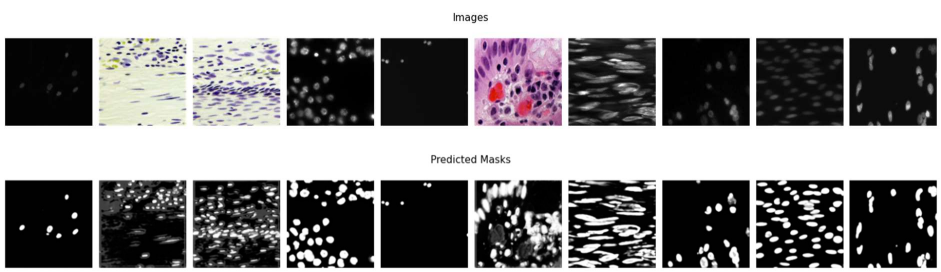

<h2> Cell Segmentation </h2>

The study aims to determine a solution for the automatic segmentation and localization of cells. I have tried to utilise UNet++ architecture over UNet to detect cell nuclei and perform segmentation into individual objects.

## Image sets and experiment description

- **Dataset** which was used was extracted from the mentioned repo data: <a href="https://github.com/Subham2901/Nuclei-Cell-segmentaion/tree/master/Data">Shubham2901/Nuclei Cell Segmentation</a>

| Dataset | Images | Input Size | Modality | Provider |
| --- | --- | --- | --- | --- | 
| Cell Nuclei | 670 | 96x96 | microscopy | Kaggle Data Science Bowl 2018|

   
  <samp>Block diagram for the overall process</samp>

## Results Obtained

TP, FP, TN and FN are the numbers of true positive, false positive, true negative 
and false negative detections.

|  |  |
| --- | --- |
| <b>Precision Score</b> | 0.91 |
| <b>Recall Score</b> | 0.85 |
| <b>F-1 Score</b> | 0.88 |
| <b>Sensitivity</b> | 0.85 |
| <b>Specificity</b> | 0.99 |
| <b>IOU</b> | 0.79 |
| <b>AUC</b> | 0.92 |

|  | Precision | Recall | F-1 Score | Support |
| --- | --- | --- | --- | --- |
| False | 0.98 | 0.99 | 0.98 | 5707370 |
| True | 0.91 | 0.85 | 0.88 | 846230 |
| Accuracy ||| 0.97 | 6553600 |
| Macro Avg | 0.95 | 0.92 | 0.93 | 6553600 |
| Weighted Avg | 0.97 | 0.97 | 0.97 | 6553600 |

## Final Result

  
  

## Future of Cell Segmentation

With the rise of size and complexity of cell images, the requirements for cells segmentation methods are also increasing. The basic image processing algo developed decades ago should not be the golden standards for dealing with these challenging cell segmentation problems any more.

On the contrary, development of more effective image processing algorithms is more promising for the progress of cell segmentation. In the meantime, comparison of these newly developed algorithms and teaching the biologists to use these newly developed algorithms are also very important. Hence, the open access and authoritative platforms are necessary for researchers all over the world to share, learn, and teach the data, codes, and algorithms. 

---
