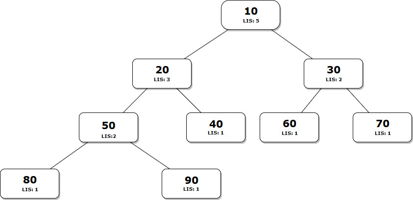

# Longest Independent Set

## Description

Given a Tree, find size of the Largest Independent Set(LIS) in it. A subset of all tree nodes is an independent set if there is no edge between any two nodes of the subset.

## Example

Consider the following binary tree. The Largest Independent Set(LIS) is `{10, 40, 60, 70, 80}` and size of the LIS is `5`.

## Solution

We will have to look for the subproblems to apply the dynamic programming approach. Can this problem be divided into subproblems so that each of those problems can be solved easily? The answer is, yes. You can find the Largest Independent Set for a node if you know the LIS for all the child nodes. If the node is part of LIS then it's children can't be a part of LIS because of Independent Set's definition. We will be only discussing LIS for binary tree but this solution can be generalized. If we want to solve this as a Dynamic Programming problem then we will have to find the Optimal Substructure and Overlapping Subproblems property.

1. **Optimal Substructure**
    - there are two possibilities for every node X, either X is a member of the set or not a member. If X is a member, then the value of LIS(X) is 1 plus LISS of all grandchildren. If X is not a member, then the value is sum of LISS of all children.
    - let LIS(X) indicate size of largest independent set of a tree with root X.
      `LIS(X) = MAX { (1 + sum of LIS for all grandchildren of X), (sum of LIS for all children of X) }`

2. **Overlapping Subproblems**
    - While solving the subproblems, we encounter that we have to find the solutions of the same subproblems again and again. When we have a node which has a parent and grandparent, it LIS will get calculated for that node multiple times and that is the overlapping subproblems property.

Using memoization or tabulation to store the results of the subproblems, the time complexity of above approach is `O(n)`.

---

A massive collaborative effort by <a href="https://github.com/opengenus/cosmos">OpenGenus Foundation</a>

---
