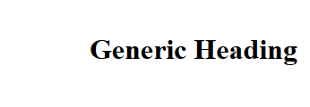

# CSS Position

The CSS **position** property is used to specify the position of HTML element in the webpage.
Once the position property is set to a given value/keyword. The HTML element has a defined location from which it can be shift relatively using the following keywords:
* **top**
* **bottom**
* **left**
* **right**

The CSS position property can take following values:
1. Static
2. Fixed
3. Relative
4. Absolute
5. Sticky

**Syntax: CSS Position**
```html
<style>
    HTML_element
    {
    position: {keyword};
    top: {value};
    bottom: {value};
    right: {value};
    left: {value};
    }
</style>
```

**Example:**
```html
<style>
    h1
    {
    position: absolute;
    top: 40px;
    left: 100px;
    }
</style>
<h1> Generic Heading </h1>
```

**Output:**

