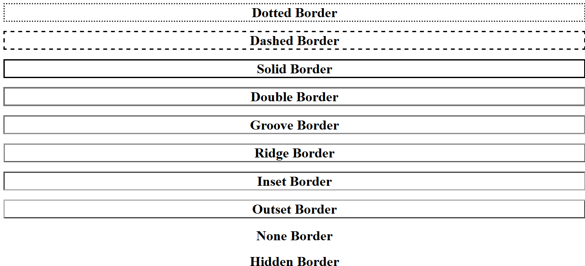

# CSS Basics: Borders

CSS Borders are used to create border around any HTML Tag.
Borders include following feature:

* **Style:** The type of border you want as in solid, dashed etc. It is a compulsory attribute for border.
* **width:** It defines the thickness of the border. It is an optional attribute and has inbuilt default value.
* **Color:** It defines the color of the border. 
    Default color is black.
* **Radius:** A new feature supported by latest web browsers is adding a rounded edge to borders.

## Table of contents:

[1. Border-style](src/Border_style.html)

[2. Border-width](src/Border_width.html)

[3. Border-Color](src/Border_color.html)

[4. Individual Border](src/Individual_border.html)

[5. Shorthand property](src/Shorthand_property.html)

[Rounded Borders](src/Rounded_Border.html)

