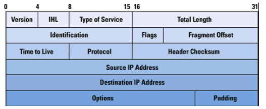
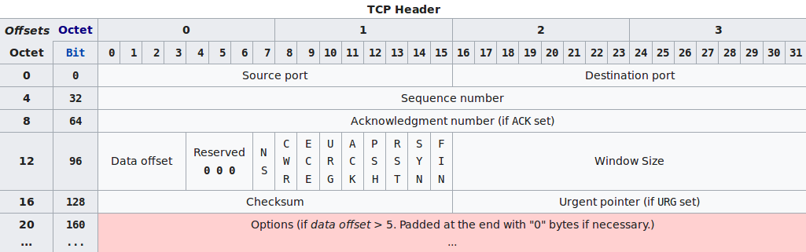
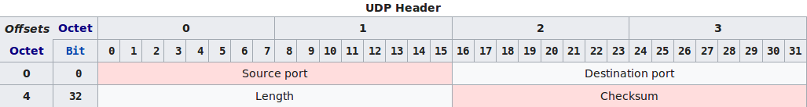

## Usage

 ```shell
 # python packetSniffer.py 
```
- At the end of the execution of the analyzer, will have a file with name 'aux.pcap'. You can execute this file with wireshark to obtain more information about the tracking.

## Packet Sniffer (Packet Analyzer)

A packet analyzer (also known as a packet sniffer) is a computer program or piece of computer hardware that can intercept and log traffic that passes over a digital network or part of a network. Packet capture is the process of intercepting and logging traffic. As data streams flow across the network, the sniffer captures each packet and, if needed, decodes the packet's raw data, showing the values of various fields in the packet, and analyzes its content according to the appropriate RFC or other specifications.

A packet analyzer used for intercepting traffic on wireless networks is known as a wireless analyzer or WiFi analyzer. A packet analyser can also be referred to as a network analyzer or protocol analyzer though these terms also have other meanings. [Text of Wikipedia](https://en.wikipedia.org/wiki/Packet_analyzer)

## Protocols

- ***Ethernet***: The header of the ethernet frame contains the MAC addresses of destination and source and the data with headers of another protocol. In my packet analyzer, I always analyze the internet protocol.
- ***IPv4***: The IPv4 protocol is used for packet-switched networks. Is responsible for addressing the hosts, and route data from a source to a host. Each datagram has a header and a payload (data to transport). Nest the payload into a packet with header is called encapsulation.
- ***TCP***: The TCP is a protocol of the transport layer. It functionality involves reliability, error verification, and others. This protocol provides a communication service at an intermediate level between an application program and the Internet Protocol. It is an abstraction of the network connection to the application.
- ***UDP***: Is the most simple protocol of the transport layer. UDP uses a communication without connection complexity. Provides checksums for data integrity and port numbers for addressing different functions at the source and destination of the datagram.

## Protocol Datagrams

### ***Ethernet Frame***


### ***IPv4 Frame***


### ***TCP Frame***


### ***UDP Frame***

