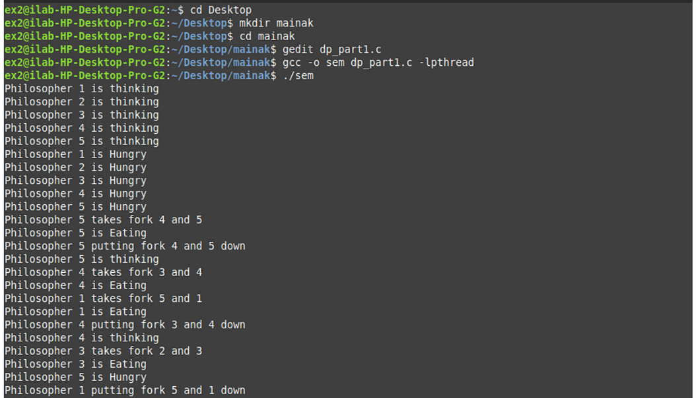

# What is Dining Philosophers Problem in OS

 Five philosophers are sitting around a circular table and their job is to think and eat alternatively. A bowl of noodles is placed at the center of the table along with five chopsticks for each of the philosophers. To eat a philosopher needs both their right and a left chopstick. A philosopher can only eat if both immediate left and right chopsticks of the philosopher is available. In case if both immediate left and right chopsticks of the philosopher are not available then the philosopher puts down their (either left or right) chopstick and starts thinking again.

The dining philosopher demonstrates a large class of concurrency control problems hence it's a classic synchronization problem.

# What are Semaphores?

Semaphores are integer variables that are used to solve the critical section problem by using two atomic operations, wait and signal that are used for process synchronization.

