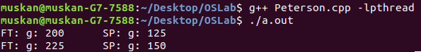

# Operating Systems
Operating Systems are software programs that communicate with the hardware and other application programs. They are responsible for a number of functions such as resource allocation in multi-user systems, management of files and processes (a 'process' is used to refer to a program in execution), handling Input-Ouput requests by different processes and main memory management among other roles. Operating system is one of the most crucial system components of a computer and provides the basic functionality for the device, right from the boot procedure. Additionally, it has many algorithms which enable it to make decisions about CPU scheduling such as First Come First Serve (FCFS) scheduling, Shortest Job First scheduling and Multilevel queue scheduling among others.
Computer desktop operating systems used nowadays include Windows, OS X and Linux. 

## Note:
When we use pthread.h library in our program, program doesn't execute using simple (normal) compile command. After including pthread.h header file, program doesn't compile and return error(s).

To compile C program with pthread.h library, you have to put -lpthread just after the compile command gcc thread.c, this command will tell to the compiler to execute program with pthread.h library.

# cosmos
Your personal library of every algorithm and data structure code that you will ever encounter
