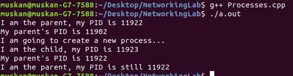

# Create and handle Processes in Linux operating system.

## Understanding the fork, sleep, wait, exit, getpid, getppid system calls and ps, kill Linux commands.

fork() command is used to create a new process. 
getpid() and getppid() commands are used to display the PID(Process ID) of the child and parent processes.
wait() command is used to control the flow of execution.

### To see what programs are currently being executed on our system.

Use the **ps** command with some additional options that provide detailed information about the processes
running on our system.
-a lists processes of all users on the system
-u gives us details about the processes
-x lists processes that run unobtrusively in the background (these are known as daemons and usually end
with a d, like systemd).

### To narrow down the list of processes.

We can use **pgrep** to lookup the processes that match a specific pattern of text.
For example, pgrep -l chrome will search processes metadata for the pattern ‘chrome’, then
display the PIDs of those processes along with the program’s name.

[Click here for more and detailed information about Processes:](https://medium.com/@eightlimbed/creating-and-killing-processes-in-linux-7d4470f1f7a6)

## Algorithm in C

```
#include<unistd.h>
#include <stdio.h>
#include <sys/types.h> 
#include <sys/wait.h> 
#include <stdlib.h>
#include <stdbool.h>
int main(void)
{
    pid_t child;
    int status;

    printf("I am the parent, my PID is %d\n", getpid());
    printf("My parent's PID is %d\n", getppid());
    printf("I am going to create a new process...\n");

    child = fork();

    if (child == -1)
    {
        // fork() returns -1 on failure
        printf("fork() failed.");
        return (-1);
    }
    else if (child == 0)
    {
        // fork() returns 0 to the child process
        printf("I am the child, my PID is %d\n", getpid());
        printf("My parent's PID is %d\n", getppid());
    }
    else
    {
        // fork() returns the PID of the child to the parent
        wait(&status); // wait for the child process to finish...
        printf("I am the parent, my PID is still %d\n", getpid());
    }
    return (0);

}
```

#Terminal Output



